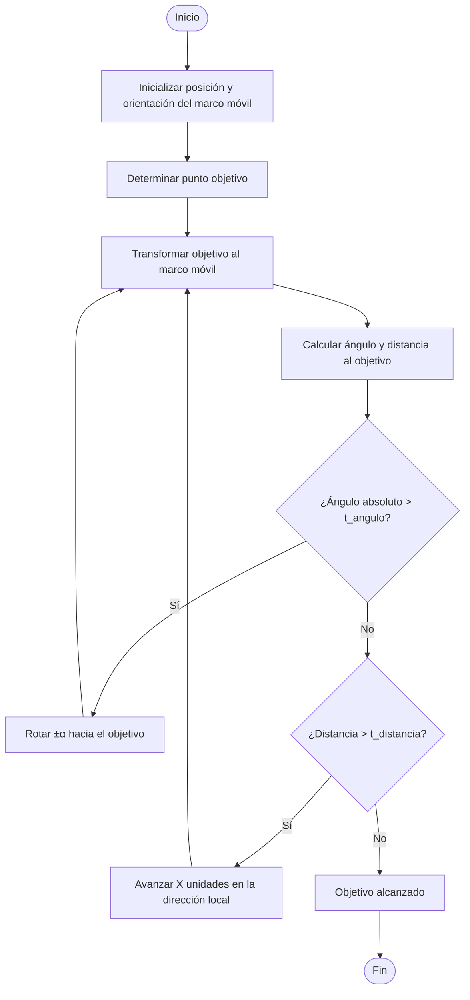

# 🦂Proyecto Fundamentos de Robótica Movil - Hexapodo v2.0

## 🪶Autores

* Andres Camilo Torres Cajamarca
* Juan Camilo Gomez Robayo
* Julian Andres Gonzalez Reina
* Emily Angelica Villanueva Serna
* Elvin Andres Corredor Torres

## ℹ️Descripción
El presente proyecto propone el desarrollo de un sistema robótico móvil orientado a la recolección de objetos identificados como “basuras” (objetos de colores en forma de bola) distribuidos aleatoriamente en un entorno delimitado. El agente principal es un robot hexápodo con 18 grados de libertad, el cual contará con un sistema de visión artificial basado en una cámara cenital que permite la localización tanto del robot como de los residuos mediante técnicas de procesamiento de imagen.

El sistema de navegación del hexápodo será asistido desde MATLAB, donde se establecerán las trayectorias hacia los puntos objetivo. Una vez en proximidad de una basura, el robot ejecutará una rutina de manipulación utilizando un gripper desarrollado en manufactura aditiva. Los objetos recogidos serán transportados a dos regiones definidas de recolección, donde se completará la tarea asignada.

El sistema se implementará sobre ROS 2 Humble como middleware principal, y el control del movimiento se realizará mediante una máquina de estados o un controlador PI, según los resultados de desarrollo. La lógica de control será acoplada a rutinas previamente definidas en simulación y modificadas para adaptarse al comportamiento del entorno físico. 

## Objetivos 
* Navegar hacia las ubicaciones de las basuras detectadas. 
* Recoger objetos con el gripper implementado. 
* Transportar los objetos a una de dos zonas predefinidas de descarga. 
* Implementar un sistema de visión artificial con cámara fija cenital para:
    * Localizar en tiempo real la posición del robot (odometría por visión). 
    * Detectar la posición de los residuos (objetos de colores).
* Integrar la visión con el entorno de control en MATLAB para generar trayectorias. 
* Evaluar el desempeño del sistema de manipulación y agarre bajo diferentes condiciones de prueba. 
* Documentar todo el proceso de desarrollo y pruebas para retroalimentación académica y técnica.

## 🎮 Control

Para el algoritmo de control, se tuvo en cuenta que el robot emplea rutinas predefinidas que por simplicidad no se modificaran para evitar rehacer la cinematica; por ello se realizó un control como una _maquina de estados discreta_, para ello se siguió el siguiente diagrama de flujo:

Donde $\alpha$ es el angulo fijo de giro, $X$ es el desplazamiento fijo, $t_{angulo}$ es la tolerancia de angulo y $t_{distancia}$ es la tolerancia de distancia; las 4 son variables que se ajustan dependiendo del robot. 

Para probar su funcionamiento se realizó el código de matlab [Prueba_Control_Matlab.mlx](Archivos/Prueba_Control_Matlab.mlx) en el que se realizaron diferentes pruebas variando el objetivo y asignando $\alpha=10°$, $x=3$, $t_{angulo}=5°$ y $t_{distancia}=1$ con ello se obtuvieron las siguientes simulaciones:

  <video src="https://github.com/user-attachments/assets/e21c846a-7afd-427c-8631-f6ba4e09c12d"></video>

Como se puede observar, en la mayoria de los casos se logra llegar al objetivo. No obstante se detectaron 2 limitantes principales a tener en cuenta:

1. El robot no puede pasar por encima del objeto. (Video 'Control a Obj=(-5,-3)')
2. Debido al angulo y desplazamiento fijos se puede llegar a un bucle tratando de llegar al objetivo. (Video 'Control a Obj=(5,2)')

Para ello, se tuvo en cuenta los siguientes datos del robot:

## Materiales

* Robot hexápodo con 18 grados de libertad, basado en arquitectura compatible con ROS 2. 
* Gripper fabricado en manufactura aditiva, acoplado a la parte frontal de hexapodo 
* Cámara cenital de alta resolución para captura del entorno. 
* Computador con ROS 2 Humble y MATLAB instalados para ejecución de control y visión. 
* Objetos de prueba: objetos de colores en forma de bola simulando basura. 
* Entorno de simulación en CoppeliaSim para pruebas virtuales de las rutinas.

## Herramientas de software

* Matlab
* CoppeliaSim
* ROS 2
* Autodesk Inventor
* Python con OpenCV

## Resultados Obtenidos
Comenzando con el desarrollo del proyecto, se tuvo a discusion el tipo de agarre que se iba a diseñar para el robot, en primera etapa se habia determinado un tipo de garra mecánica, la cual es activada con un motor que permite la apertura o el cierre de la garra como se ve.

  

En el proceso de diseño se nos aconsejo una opción de diseño con robotica suave para el agarre, esto con el fin de poder atrapar diferentes geometrias de "Basuras", optando finalmente por esta 

  
  

## Dificultades en el proceso

* se calento un motor y se daño /, lueo de 15 minutos de funcionamiento continuo se dañó, el gripper.
* el entorno del mapa no permitia inicialmente el movimiento del robot suavement por la friccion.
* el canal de comunicacion con el robot para su movimiento se sturaba con una duracion maxima de 4 minutos
* 

## Autoevaluacion Grupal

## Autoevaluacion Individual

## Bibliografía

Este proyecto no sería posible sin el desarrollo previo del Hexapodo, para mayor información del **_Hexapodo_** desarrollado por [Felipe Chaves Delgadillo](mailto:fchaves@unal.edu.co) y [Andres Camilo Torres Cajamarca](mailto:antorresca@unal.edu.co) consultar el [repositorio](https://github.com/labsir-un/Hexapod_Unal) de la organización [LabSir](https://github.com/labsir-un) de la Universidad Nacional de Colombia 
